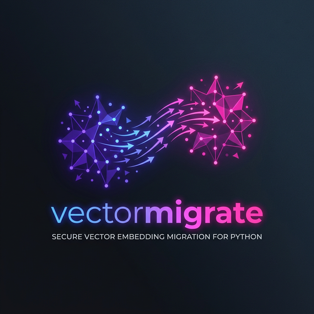
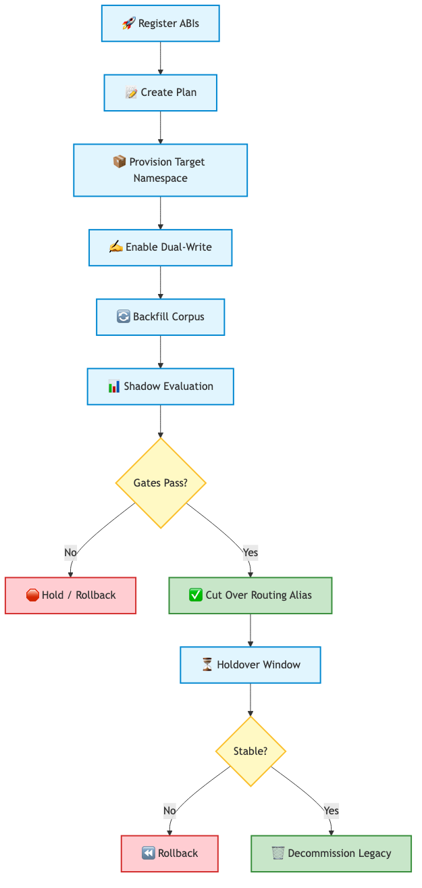

<div align="center">
  <h1>
    
    vectormigrate
  </h1>
  <p><em>Python-first tooling for safe embedding-model migration across vector retrieval systems.</em></p>
  
  [](https://badge.fury.io/py/vectormigrate)
  
  [](https://opensource.org/licenses/MIT)
  
  [](https://github.com/astral-sh/ruff)
  [](https://mypy-lang.org/)
</div>

<br>

## 💡 TL;DR

Changing your AI embedding model usually means downtime, full re-embedding costs, or silent ranking corruption. **`vectormigrate`** makes this transition safe, structured, and mathematical. It provides a formal **ABI (Application Binary Interface) for vectors**, allowing you to seamlessly test, evaluate, and transition between different embedding models in live production systems (like OpenSearch, Weaviate, Qdrant, and pgvector).

---

## 🎯 Why This Library Exists
When a team upgrades an embedding stack, it often changes more than just a model name. You might change:
- 📏 **Vector Dimension**
- 📐 **Similarity Metric**
- ⚖️ **Normalization Policy**
- ✂️ **Chunking and Preprocessing**
- 🗄️ **Backend Index Shape**

In practice, teams fall into three failure modes:
1. 💥 **Full re-embed & hard cutover:** Expensive, risky, and causes downtime.
2. 🎭 **Mixing old & new vectors:** Silently corrupts the ranking math.
3. 📜 **Vendor-specific throwaway scripts:** Weak testing and no reusable governance.

`vectormigrate` treats every embedding configuration as an explicit **compatibility contract** and turns migration into a staged, testable workflow.

---

## 📦 Dependencies
By design, `vectormigrate` is lightweight and keeps your production environment lean:
- **Core:** `numpy >= 1.26` (The exact mathematical framework needed; minimal bloat)
- **Integration (Optional):** `psycopg[binary] >= 3.2.0` (for pgvector target databases)
- **Dev/Test (Optional):** `pytest`, `ruff`, `mypy`, `build`

---

## 🚀 Quick Start

### Installation

```bash
# Core install
pip install vectormigrate

# With live backend integrations (e.g., pgvector)
pip install "vectormigrate[integration]"
```

### 1️⃣ Register an Embedding ABI (The Contract)
```python
from vectormigrate import EmbeddingABI, SQLiteRegistry

registry = SQLiteRegistry("/tmp/vectormigrate.sqlite")
abi = EmbeddingABI(
    model_id="text-embedding-3-large",
    provider="openai",
    version="2026.03",
    dimensions=3072,
)
registry.register_abi(abi)
print(f"Registered ABI: {abi.abi_id}")
```

### 2️⃣ Create a Migration Plan
```python
from vectormigrate import MigrationPlan

plan = MigrationPlan(
    source_abi_id="openai/text-embedding-3-large@2026.03#v1",
    target_abi_id="openai/text-embedding-3-large@2026.04#v1",
    alias_name="retrieval_active",
)
registry.create_plan(plan)
print(f"Active Plan ID: {plan.plan_id}")
```

### 3️⃣ Run a Live Demo CLI
Watch the orchestrator securely manage a dual-write and backfill migration locally:
```bash
python3 -m vectormigrate.cli demo --db /tmp/vectormigrate-demo.sqlite
```

---

## 📚 Feature Guide

### 🔀 Compatibility Adapters
Don't want to re-embed everything right away? Use our built-in mathematical space adapters to query old vectors with new models during the transition window:
```python
from vectormigrate import OrthogonalProcrustesAdapter, LowRankAffineAdapter, ResidualMLPAdapter

procrustes = OrthogonalProcrustesAdapter()
affine = LowRankAffineAdapter(rank=4)
mlp = ResidualMLPAdapter(hidden_dim=16, epochs=50, learning_rate=0.01)
```

### 📊 Artifact & Report Export
Prove to your team that the migration was safe with exported dashboards and artifacts:
```python
from vectormigrate import export_run_artifact_bundle

manifest = export_run_artifact_bundle(
    registry=registry,
    plan_id="plan-123",
    output_dir="/tmp/vectormigrate-artifacts",
)
```

---

## 🏗️ Architecture & Formal Model

`vectormigrate` separates the migration problem into four robust planes:
1. **Control plane**: ABI manifests, migration plans, audit events.
2. **Execution plane**: Provisioning, dual-write, backfill, alias swap, rollback.
3. **Compatibility plane**: Mathematical projections and confidence-gated routing.
4. **Evaluation plane**: Offline metrics (`Recall@k`, `nDCG@k`), shadow hooks.



### Supported Live Backends
The library includes native adapters to safely orchestrate migrations on the following engines:
- ✅ **OpenSearch**
- ✅ **Weaviate**
- ✅ **Qdrant**
- ✅ **pgvector**
- ✅ **In-Memory** (for testing)

---

## 📖 Deep Dive Documentation
- [Architecture & First Principles](docs/architecture.md)
- [Formal System Math Model](docs/paper_system_model.md)
- [Code Examples](docs/examples.md)

---

## 🤝 Contributing & Security
We welcome contributions! Please see:
- [`CONTRIBUTING.md`](CONTRIBUTING.md)
- [`SECURITY.md`](SECURITY.md)
- [`CODE_OF_CONDUCT.md`](CODE_OF_CONDUCT.md)
