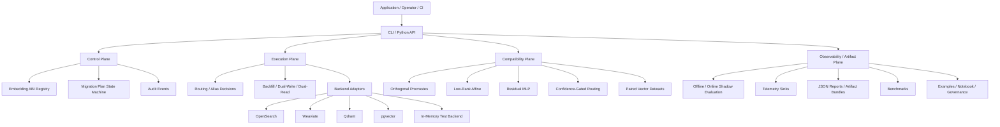
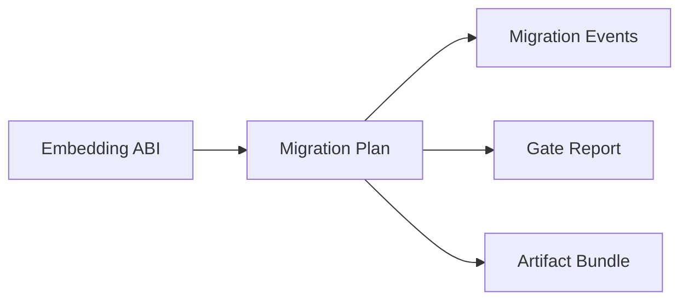
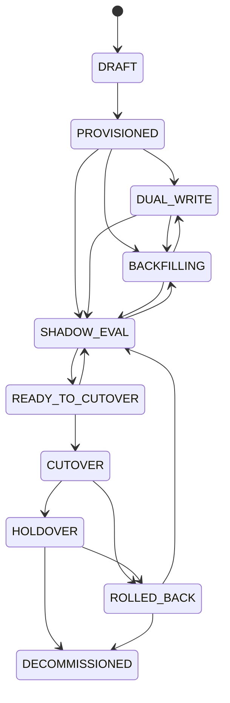
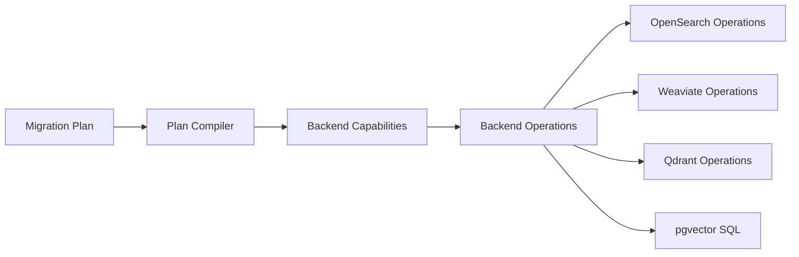
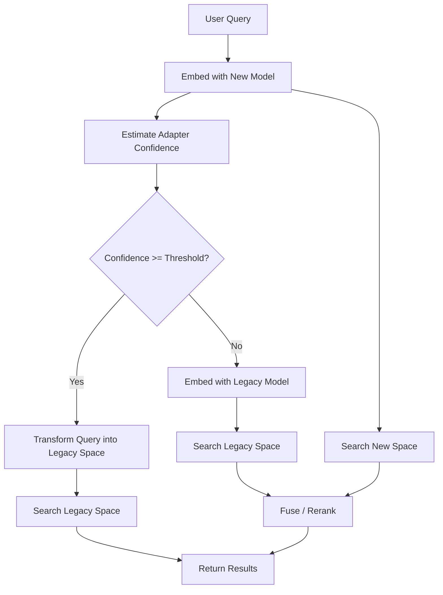

<div align="center">
  <h1>🏗️ vectormigrate Architecture</h1>
  <p><em>From-first-principles architecture of the vector migration library.</em></p>
</div>

This document explains the architecture of `vectormigrate` from first principles. It is intentionally deeper than the README and is written to serve as a future reference for technical-paper drafting.

**Companion references:**
- 📄 [`paper_system_model.md`](paper_system_model.md): paper-style problem statement, system model, and method draft
- 🗺️ [`figures.md`](figures.md): presentation-ready and paper-ready diagrams

---

## 🧭 1. Problem From First Principles

### 🔬 1.1 What an embedding system actually is

At the lowest level, a retrieval system built on embeddings is a pipeline that maps:
1. 📝 raw text or multimodal content
2. ✂️ through preprocessing and chunking
3. 🌌 into vectors in a specific latent space
4. 🗄️ indexed under a similarity metric
5. 🔍 queried by embedding user input into what *must* be the same or a compatible space

The key point is that **a vector is not meaningful in isolation**. Its meaning is defined only relative to:
- The embedding model
- The tokenizer
- The chunking/preprocessing pipeline
- The dimension count
- The normalization contract
- The distance metric
- The index configuration

If any of those change, the geometry may change. Once geometry changes, old and new vectors are no longer guaranteed to be comparable.

### 🚧 1.2 Why migrations are hard

Embedding-model migration is not merely a deployment problem. It is a **compatibility problem across learned geometric spaces**.

When teams say "we upgraded the embedding model", what often happened is one or more of these changed:
- the embedding function `f_old(x) -> R^d_old`
- the embedding function `f_new(x) -> R^d_new`
- the chunking operator `c(x)`
- the normalization or similarity function
- the storage/indexing structure used for ANN search

From first principles, retrieval correctness requires that the query vector and document vectors exist in the **same comparison regime**. That regime can be:
- The exact same space
- A jointly searchable multi-space setup
- A transformed space with a justified compatibility mapping

Without one of those, ranking becomes undefined or at least untrustworthy.

### 🧮 1.3 Formalizing the failure mode

Let:
- `q_old = f_old(query)`
- `d_old = f_old(document)`
- `q_new = f_new(query)`
- `d_new = f_new(document)`

Legacy retrieval ranks by:
- `score_old(q_old, d_old)`

After migration, desired retrieval ranks by:
- `score_new(q_new, d_new)`

**The migration problem appears when a serving system accidentally computes:**
- ❌ `score(q_new, d_old)` *(or mixes `d_old` and `d_new` in one index without a compatibility contract)*

That is the core failure `vectormigrate` is designed to prevent.

---

## 🚫 2. Why Simpler Solutions Fail

### 🔨 2.1 Naive option A: full re-embedding and hard cutover
This is operationally simple in theory:
1. Re-embed everything
2. Rebuild the index
3. Switch traffic

**Why it fails in practice:**
- 💸 Large corpora make full re-embedding expensive
- ⚠️ Hard cutovers create rollback risk
- 📉 Quality regressions may only appear under live traffic
- 📜 There is often no durable audit trail for what changed

### 🎭 2.2 Naive option B: mix old and new vectors
This is the worst failure mode because it often *appears* to work.

**Why it fails:**
- 🌪️ Score semantics drift
- 🏘️ ANN neighborhoods become incoherent
- 🕵️‍♂️ Debugging becomes impossible because incompatibility is silent

### 📝 2.3 Naive option C: vendor-specific migration scripts
This is common and sometimes necessary, but it does not generalize.

**Why it fails as a platform strategy:**
- 🧩 Every backend expresses different primitives
- ♻️ Migration logic gets duplicated
- 🧱 Compatibility logic gets separated from operations logic
- 🧪 Tests and evaluation are usually thin

---

## 🏛️ 3. Architectural Thesis

`vectormigrate` is built around one central claim:
> 💡 **Embedding migration must be treated as a control-plane problem over a data-plane compatibility boundary.**

That produces five architectural consequences:
1. 📜 **Embeddings must be versioned as a contract**
2. 💾 **Migration state must be explicit and durable**
3. 🔀 **Serving cutover must be decoupled from background backfill**
4. 🌉 **Compatibility bridges must be optional but composable**
5. 🔌 **Backend integrations must compile to natively** rather than leaking backend details into the core.

---

## 🏗️ 4. System Architecture

### 4.1 Top-level view



### 🛰️ 4.2 First-principles decomposition

The architecture separates concerns according to what can and cannot be allowed to vary.

**🧱 Stable across all backends:**
- ABI semantics
- Migration lifecycle
- Evaluation logic
- Compatibility-routing logic
- Artifact and audit semantics

**🔌 Backend-dependent:**
- Alias primitives
- Reindex/backfill primitives
- Named-vector support
- Server-side reranking support
- Query request syntax

That is why the core is backend-neutral and adapters compile plans into backend-specific operations.

---

## 🔐 5. The Foundational Abstraction: Embedding ABI

### 5.1 Why ABI instead of "model name"

A model identifier alone is too weak. If chunking changes while the model name stays constant, the serving contract still changed.

`EmbeddingABI` exists because the true compatibility object is:

```text
ABI = {
  model_id,
  provider,
  version,
  dimensions,
  distance_metric,
  normalization,
  chunker_version,
  tokenizer,
  preprocessing_hash,
  embedding_scope,
  adapter_chain
}
```

This is analogous to an application binary interface:

- it names the contract
- it makes incompatibility explicit
- it lets tooling reason about transitions

### 5.2 Architectural consequence

Once the system treats embeddings as ABIs, several things become possible:

- backends can be indexed by ABI
- audit trails can refer to exact embedding contracts
- migration plans can be expressed as `source_abi -> target_abi`
- rollback can restore a known compatible serving target

## 6. Control Plane Design

### 6.1 Why a control plane is necessary

Migration is a long-running, multi-step change. Therefore the system must persist:

- what migration exists
- which state it is in
- why it moved to that state
- what evidence justified the move

If that state is only in memory or in ad hoc scripts, the migration is operationally opaque.

### 6.2 Control-plane model



The current implementation stores this in SQLite because:

- it is deterministic in CI
- it is inspectable
- it keeps the core dependency-light

The deeper architectural point is not SQLite itself. It is that migration control state is durable and queryable.

### 6.3 State machine



This state machine is deliberately restrictive. The restriction is a feature:

- it prevents illegal operational transitions
- it makes evaluation a first-class gate
- it exposes rollback as a real lifecycle state, not an ad hoc emergency action

## 7. Data Plane Design

### 7.1 Why data plane must be abstracted

Every vector database exposes different operational primitives. A backend-neutral tool cannot pretend the primitives are identical.

Instead, `vectormigrate` models a minimal data-plane contract:

- create namespace/index/collection
- index/upsert vectors
- query vectors
- map a stable alias or routing name to a concrete namespace when possible

### 7.2 Adapter pattern



The adapter layer solves two problems simultaneously:

1. it preserves a single conceptual migration model
2. it respects the fact that backends differ materially

### 7.3 Why this is superior to a generic ORM-like abstraction

A generic storage abstraction often collapses meaningful differences. Here that would be harmful because the differences are exactly what matter:

- alias swap availability
- named-vector support
- query syntax
- reindex behavior
- server-side reranking support

Therefore `vectormigrate` uses capability-driven compilation rather than pretending all backends have the same lifecycle.

## 8. Compatibility Plane Design

### 8.1 Why a compatibility plane exists at all

Operational migration alone is insufficient when re-embedding cost or latency is too high. A second layer is needed that can reduce or defer re-embedding.

That layer attempts to approximate:

- `f_old(x) ≈ T(f_new(x))`

for some transformation `T`.

### 8.2 Adapter ladder

The project currently implements three increasing-capacity approximators:

1. Orthogonal Procrustes
2. Low-Rank Affine
3. Residual MLP

These correspond to progressively stronger hypotheses about cross-space drift.

#### Orthogonal Procrustes

Assumption:

- the main drift is approximately rotational or dot-product preserving

Strengths:

- interpretable
- fast
- low inference overhead

Weakness:

- too weak for heterogeneous or nonlinear drift

#### Low-Rank Affine

Assumption:

- drift is linear but not necessarily orthogonal

Strengths:

- more expressive than Procrustes
- still relatively simple

Weakness:

- still cannot represent richer nonlinear deformation

#### Residual MLP

Assumption:

- drift contains nonlinear components, but inference cost must remain modest

Strengths:

- most expressive of the current baselines
- residual form preserves identity prior

Weakness:

- more sensitive to training data quality
- higher inference and fitting cost

### 8.3 Why confidence gating exists

A compatibility adapter should not be trusted uniformly across all queries. Some queries lie near the training manifold; others do not.

Therefore the serving decision becomes:

```text
if confidence(adapter, query) >= threshold:
    use adapter path
else:
    use safer fallback, typically dual-read
```

This is a foundational safety principle:

- make the high-risk path conditional
- make the fallback explicit

### 8.4 Query-routing architecture



This is not just an optimization. It is an explicit risk-control mechanism.

## 9. Evaluation Plane

### 9.1 Why evaluation is part of architecture

Many systems treat evaluation as an offline experiment disconnected from migration operations. `vectormigrate` treats evaluation as a control-plane dependency.

That means:

- plans move through `SHADOW_EVAL`
- metrics become gate conditions
- reports are persisted
- artifacts can be reviewed later

### 9.2 Core metrics

The current core metrics are:

- `Recall@k`
- `nDCG@k`

These were chosen because:

- they are standard in retrieval
- they are interpretable
- they are simple enough to remain backend-neutral

### 9.3 Why this is not enough for a paper

For publication-grade evaluation, future work should add:

- latency distributions under realistic load
- cost-per-query and cost-per-migration
- robustness under domain shift
- calibration quality of confidence gating
- ablations across adapter families

## 10. Observability, Reproducibility, and Community Layer

### 10.1 Why artifact bundles matter

A migration is not complete when the cutover succeeds. It is complete when the evidence for that change is reproducible.

That is why the architecture includes:

- JSON reports
- artifact bundles
- manifest files
- audit events

These provide a paper-friendly and operations-friendly trail.

### 10.2 Why telemetry hooks matter

The architecture must allow online shadow measurements later, even when local development uses in-memory sinks.

Therefore telemetry is abstracted into sinks:

- in-memory sink for tests
- JSONL sink for local inspection
- OpenTelemetry-like bridge for future production integration

### 10.3 Why plugin architecture matters

If the system is meant to help the AI community broadly, the backend surface cannot remain closed.

The plugin registry exists because:

- new vector databases will continue to appear
- organizations may need private/internal adapters
- publishable tooling benefits from ecosystem extensibility

## 11. End-to-End Migration Example

Consider a corpus of 10 million chunks indexed under `ABI_A`.

Goal:

- migrate to `ABI_B`
- avoid downtime
- preserve retrieval quality

The architecture supports this sequence:

1. Register `ABI_B`.
2. Create migration plan `ABI_A -> ABI_B`.
3. Provision target namespace/index.
4. Enable dual-write for new documents.
5. Backfill historical documents to `ABI_B`.
6. Run shadow evaluation over offline judgments and sampled traffic.
7. If quality gates pass, switch alias or routing target.
8. Keep old space in holdover.
9. If failures appear, rollback alias to `ABI_A`.
10. Once stable, decommission old space.

If re-embedding is too expensive or a phased transition is needed:

1. Train a compatibility adapter on paired vectors.
2. Route confident queries through the adapter path.
3. Route uncertain queries through dual-read fusion.
4. Continue backfill in the background.

This is exactly why the architecture separates:

- control state
- execution state
- compatibility logic
- evaluation

## 12. Why This Architecture, Not Others

### 12.1 Alternative 1: database-native migration only

Pros:

- operationally direct
- fewer abstraction layers

Cons:

- backend-specific
- weak portability
- no unified compatibility layer
- harder to publish as a general framework

### 12.2 Alternative 2: compatibility-only system

Pros:

- cheaper than full re-embedding in some cases

Cons:

- does not solve operations lifecycle
- cannot guarantee safe cutover
- ignores auditability and rollback

### 12.3 Alternative 3: monolithic end-to-end platform

Pros:

- potentially simpler user story

Cons:

- heavy dependency surface
- poor modularity
- harder community contribution model

### 12.4 Chosen architecture

The chosen architecture is a layered hybrid:

- operational migration is the baseline correctness layer
- compatibility tooling is the optimization layer
- backend adapters are compiled, not hardcoded into the core
- evaluation is a gate, not an afterthought

That is the most defensible architecture from both an engineering and publication perspective.

## 13. What Makes This Potentially Publishable

The publishable angle is not that vector migrations exist. It is the combination of:

- a formalized ABI abstraction for embedding compatibility
- a control-plane state machine for migration governance
- a backend-capability compilation model
- integration of compatibility adapters into an operational migration workflow
- explicit confidence-gated serving as a safety mechanism

A strong technical paper built from this work could contribute:

1. a formal problem statement for embedding-space migration
2. a reference architecture for safe migration tooling
3. empirical comparison of operational and compatibility strategies
4. an evaluation methodology for migration readiness and rollback safety

## 14. Suggested Paper Experiment Structure

If this becomes a paper, the experiments should likely compare:

- hard cutover with full re-embedding
- dual-read fusion
- Procrustes adapter
- low-rank affine adapter
- residual MLP adapter
- confidence-gated hybrid routing

Across variables such as:

- corpus size
- embedding dimension change
- model family change
- domain shift magnitude
- latency budget
- paired-data budget

## 15. Summary

`vectormigrate` solves the migration problem this way because the problem itself is layered:

- geometry changes create compatibility risk
- operational changes create availability risk
- backend diversity creates systems-integration risk
- lack of evidence creates governance risk

So the architecture must also be layered:

- ABI layer for compatibility identity
- control plane for migration governance
- execution plane for backend operations
- compatibility plane for cost/latency reduction
- evaluation and artifact layer for evidence
- plugin/community layer for ecosystem scale

That is the foundation-level logic behind the design.
