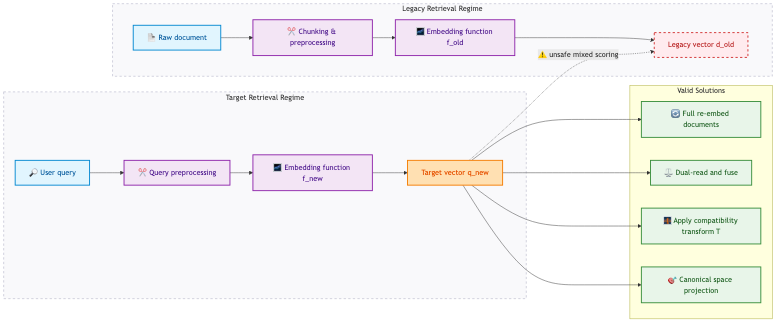
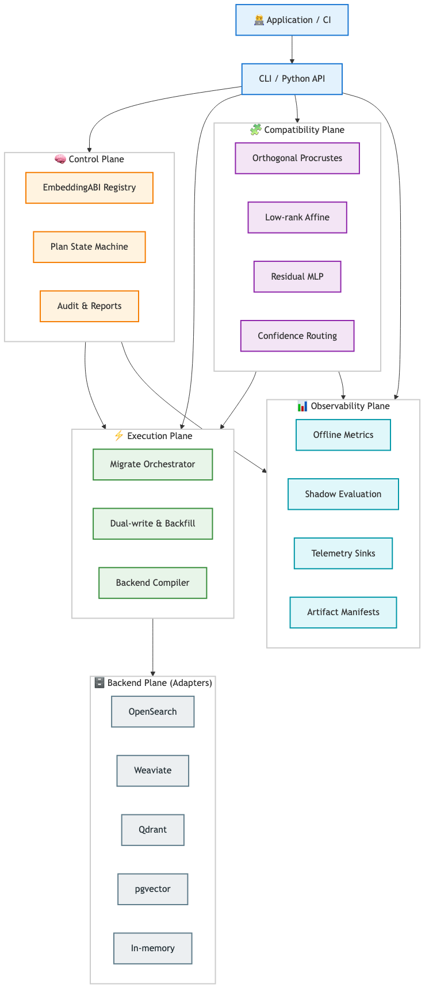
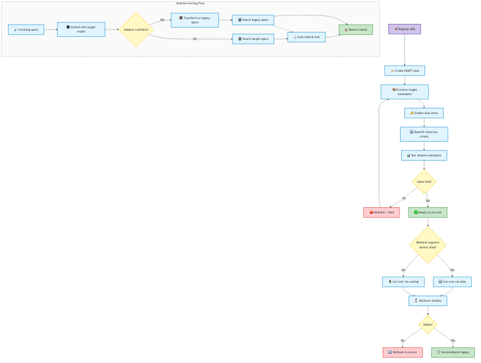
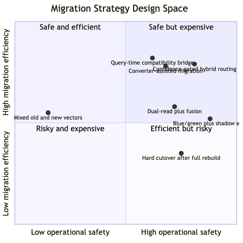

# vectormigrate Figures

This document collects polished diagrams for presentations, design reviews, and future paper drafting. The emphasis is on figures that explain the problem, the layered architecture, and the operational flow.

## Figure 1. First-Principles Failure Model

This figure shows why embedding migration is not a trivial “model swap.” The incompatibility arises because vector comparison is only valid inside a shared comparison regime.

**Interpretation**

- `q_new` and `d_old` cannot be assumed comparable.
- The migration problem starts before the vector database. It starts at the retrieval objective.
- The system must either restore comparability or keep old and new retrieval paths separate.

## Figure 2. Layered Architecture

This figure shows the architecture chosen in `vectormigrate`. The layers are separated by what must remain globally stable versus what can vary by backend, migration strategy, or research method.

**Interpretation**

- The control plane defines truth about what is allowed.
- The execution plane decides how a migration is carried out.
- The compatibility plane provides optional bridges, not hidden side effects.
- The evaluation plane determines whether a candidate path is acceptable.
- Backend adapters are compilers of intent, not owners of migration semantics.

## Figure 3. End-to-End Migration and Serving Flow

This figure connects lifecycle state transitions with query-serving decisions. It shows how `vectormigrate` separates slow background work from the serving path while preserving rollback options.

**Interpretation**

- Provisioning and backfill are offline operational phases.
- Serving can continue safely during migration because routing and compatibility are explicit.
- Rollback remains possible until the holdover window expires.

## Figure 4. Design-Space Comparison

This optional figure is useful in a paper or talk when explaining why the chosen architecture is not simply one point solution but a deliberate synthesis across multiple migration strategies.

**Interpretation**

- No single strategy dominates under every constraint.
- The architecture intentionally supports multiple strategies because workload scale, backend capabilities, and quality tolerance differ across deployments.
- Confidence-gated hybrid routing is attractive because it can approach the efficiency of compatibility methods without giving up the safety posture of measured fallback behavior.

## Recommended Use in a Paper

Use the figures in this order:

1. Figure 1 to define the problem precisely.
2. Figure 2 to explain the system architecture and design boundaries.
3. Figure 3 to show the operational lifecycle and serving behavior.
4. Figure 4 only if the paper includes a design-space or systems tradeoff discussion.

## Notes for Later Refinement

When converting these figures into a formal manuscript:

- replace implementation names with generalized system labels where needed
- align notation with the mathematical notation in the paper body
- add numbered captions and cross-references
- export high-resolution static versions if the target venue does not support Mermaid
